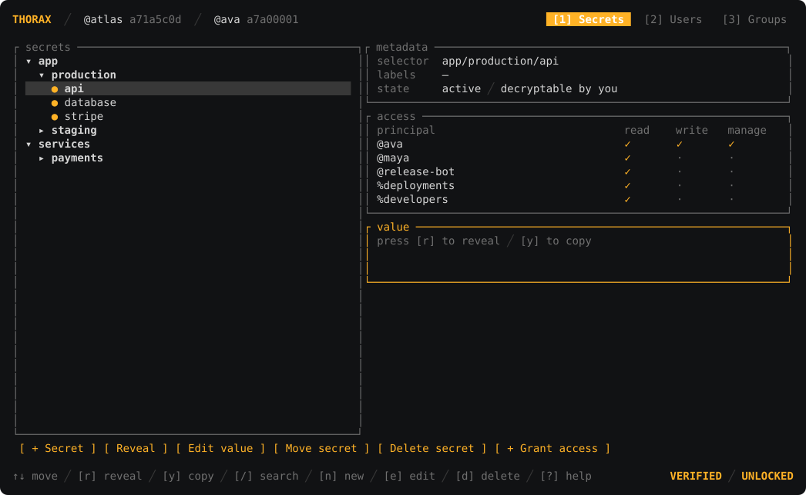
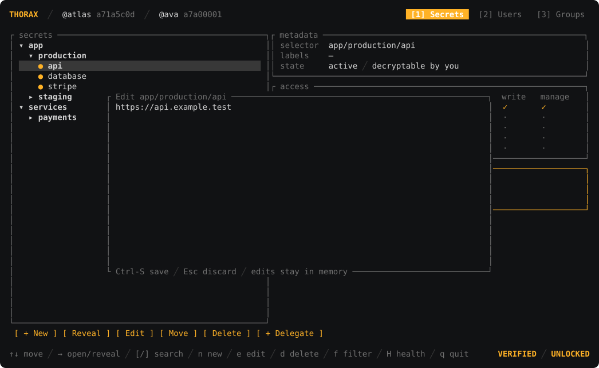
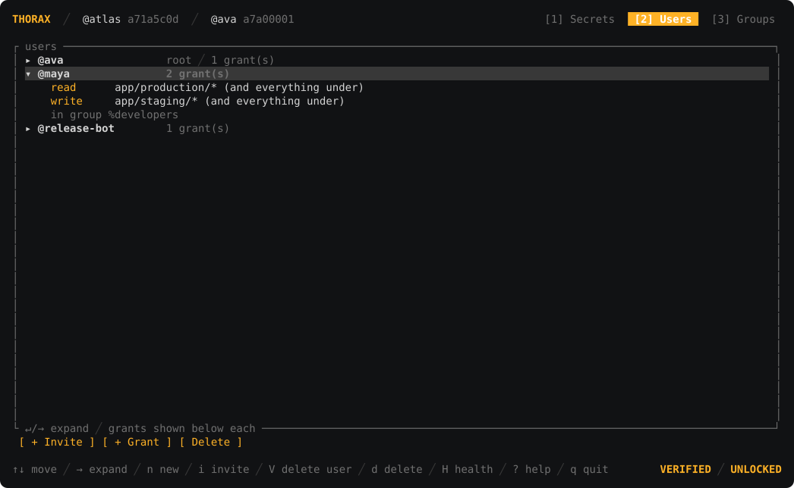
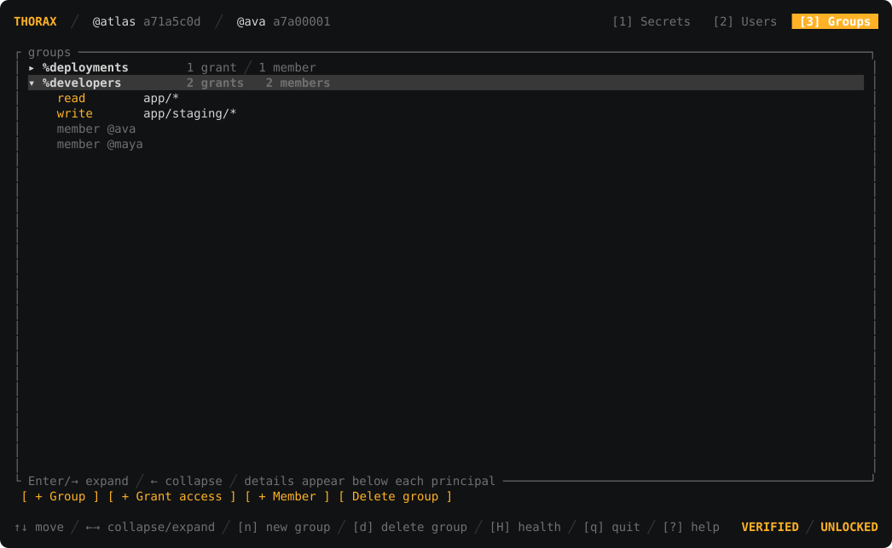
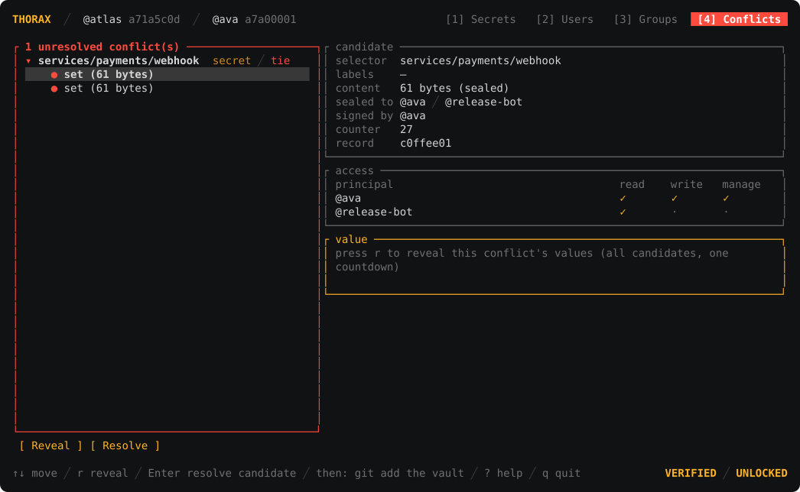

# 


Thorax is secrets management for humans, agents, and apps.

Store your secrets in one encrypted vault and use them everywhere: from local development and CI to application code and Kubernetes. The vault can live in Git, with access rules and signed history built in, so there's no secrets server to run or separate copies to keep in sync.

- **Use Thorax everywhere you work**: script with the CLI, manage the vault in a keyboard-driven TUI, use native SDKs in Rust, Python, and Node apps, or bring secrets to an app written in any other language with `thorax run`.
- **Store and collaborate in Git**: commit the encrypted vault beside your code, branch it, review it, and merge it. Thorax combines compatible signed histories automatically, detects rollbacks and contested edits, and gives authorized users explicit conflict resolution in the CLI or TUI.
- **Deliver natively to Kubernetes**: a namespaced controller enrolls with its own identity and projects only its authorized fields into standard Kubernetes Secrets.
- **Carry least authority into production**: grant read, write, or access-management authority to humans, agents, groups, and workloads on exact secrets or path prefixes.
- **Keep secrets out of agent context**: code, commands, and deployment manifests refer to secret selectors instead of plaintext values. Thorax releases values only through an authorized runtime surface, and dedicated agent identities can be restricted to exactly the paths they need.

## One Vault, Every Surface

| Where | Thorax surface | What receives plaintext |
|---|---|---|
| Human at a terminal | CLI or TUI | The explicit terminal, file, or clipboard action |
| Local process | `thorax run` | The selected child-process environment |
| Rust, Python, or Node app | Native SDK | The authorized SDK caller |
| Agent or CI job | CLI, SDK, or dedicated identity | Only selectors granted to that identity |
| Kubernetes namespace | Thorax controller | Only fields selected into owned Kubernetes Secrets |
| Git repository or mirror | Signed vault and merge driver | Nothing; the repository carries ciphertext |

Every surface uses the same cryptographic state and authorization rules. A selector such as `app/prod/db` means the same thing in a grant, a CLI command, an SDK call, an environment-injection plan, and a Kubernetes projection.

For example, the same selector can move from development to deployment without inventing a new secret name or copying its value:

| Surface | Reference |
|---|---|
| CLI | `thorax get app/prod/db` |
| Any local process | `thorax run DATABASE_URL=app/prod/db -- ./server` |
| Rust SDK | `vault.get_string("app/prod/db")?` |
| Python SDK | `vault.get("app/prod/db")` |
| Node SDK | `await vault.get("app/prod/db")` |
| Kubernetes projection | `selector: app/prod/db` |

## Installation

### Install the CLI

Linux and macOS:

<!-- BEGIN PINNED INSTALL: regenerated for each release; do not edit by hand -->
```sh
f="$(mktemp)" && curl -fsSL -o "$f" "https://github.com/backbone-hq/thorax/releases/download/vX.Y.Z/install.sh" && echo "<sha256 from the GitHub Release notes>  $f" | { command -v sha256sum >/dev/null && sha256sum -c - || shasum -a 256 -c -; } && THORAX_VERSION=vX.Y.Z sh "$f"
```
<!-- END PINNED INSTALL -->

Paste the command whole. It pins and verifies the release installer before running it. The installer verifies a platform bootstrap executable, which then verifies the signed release manifest and the selected Thorax binary before installation.

Or install the CLI with Cargo:

```sh
cargo install thorax
```

Windows users can download `thorax-x86_64-pc-windows-msvc.exe` from the latest [GitHub Release](https://github.com/backbone-hq/thorax/releases).

Check for a newer signed release at any time:

```sh
thorax update --check
thorax update
```

### Add an SDK

Choose the native package for your app:

```sh
# Rust
cargo add thorax-sdk

# Python
pip install thorax

# Node
npm install @backbone-hq/thorax
```

API documentation is available on [docs.rs](https://docs.rs/thorax-sdk), [PyPI](https://pypi.org/project/thorax/), and [npm](https://www.npmjs.com/package/@backbone-hq/thorax).

## Quick Start

Initialize a vault in a project:

```sh
thorax init
```

Thorax creates `.thorax/vault.cord`, stores the root identity in a passphrase-protected local keychain, and registers its Git merge and text-conversion drivers when the project is a Git repository.

Store a value through stdin so it does not enter shell history or process arguments:

```sh
printf '%s' "$DATABASE_URL" | thorax set app/prod/db
thorax get app/prod/db
thorax list
```

Open the full-screen control plane:

```sh
thorax
```

Or launch an app with only the secrets it needs:

```sh
thorax run DATABASE_URL=app/prod/db -- ./server
```

## Keep Secrets Out of Agent Context

Coding agents routinely ingest source trees, diffs, configuration, terminal output, and logs. A plaintext credential can enter a model context simply because it was present in a file or command.

Thorax changes that default. The repository carries signed ciphertext. Code, commands, and deployment manifests carry stable selectors such as `app/prod/db`. An agent can build an integration around that selector without seeing the value behind it, while an authorized app, process, or Kubernetes controller resolves it at runtime.

A typical agent workflow looks like this:

1. Give the agent the selector `app/prod/db`, not the database credential.
2. Let it write code, tests, commands, and manifests against that selector.
3. Run the resulting app with `thorax run`, a native SDK, or the Kubernetes controller so plaintext is released only to the authorized runtime.
4. If the agent genuinely needs the value, give it a dedicated Thorax identity with access only to the required selector or prefix.

When an agent genuinely needs plaintext, give it a dedicated Thorax identity and grant only the exact secrets or prefixes required for the task. The identity is separate from a developer's human identity, so its authority can be reviewed, changed, revoked, and rotated independently.

Thorax cannot control plaintext after an authorized agent or process receives it. Its advantage is making most work possible without releasing a value at all, and making necessary access explicit and narrow.

## Secrets and Selectors

Secrets are addressed by paths and optional labels:

```text
app/prod/db
app/prod/db@region=eu&tier=primary
```

Selectors work across the CLI, grants, SDKs, `thorax run`, and Kubernetes. A path selector matches that path and everything beneath it by default. Labels can filter by value, presence, or absence.

A secret can hold binary data, a primary value, and additional named fields:

```sh
printf '%s' app | thorax field set app/prod/db username
printf '%s' "$DATABASE_PASSWORD" | thorax field set app/prod/db password
thorax field list app/prod/db
```

Secrets can be moved to a new path or label set without exposing their value:

```sh
thorax move app/staging/db app/prod/db
```

## Runtime Injection

`thorax run` is the language-agnostic integration. Use it with Go, Ruby, Java, shell scripts, packaged software, or any other process that reads configuration from its environment. It expands selectors against verified vault state, decrypts the complete requested set, and launches the child directly without an intermediate shell:

```sh
# Inject every secret under app/prod using derived names such as APP__PROD__DB
thorax run app/prod -- ./server

# Select by labels
thorax run 'app@env=prod&tier=web' -- ./server

# Preview names and selectors without launching the command
thorax run --dry-run app/prod -- ./server
```

The run fails before launch if a selector matches nothing, a requested secret is conflicted or unavailable, two secrets produce the same variable name, or an inherited environment variable would be overwritten. Additional fields become variables such as `DATABASE__USERNAME`. Thorax also removes injected identity seeds and keychain passphrases from the child environment.

Environment variables remain an intentionally convenient delivery mechanism. They can be visible to same-user process inspection, crash reporting, debugging tools, and child processes. Use an SDK or a narrower platform integration when those properties do not fit the workload.

## Collaboration and Access

Invite a teammate with scoped authority. The invite is a private capability that must be delivered over a secure channel:

```sh
# Admin
thorax user invite alice --read app/prod --invite-file alice.thrx

# Alice
thorax claim alice.thrx
```

Invites can also be rendered as QR codes. Every invite pins the intended vault root and embeds the rollback baseline needed to reject an older valid checkout on first sync.

Authority can be granted to users or groups:

```sh
thorax group create developers
thorax group add developers @alice
thorax grant read %developers app/staging
thorax grant write @alice app/prod/db --exact
thorax grant manage @lead app/prod
```

Thorax distinguishes read, write, manage, and vault-wide administration. Manage grants can be limited to the permission classes their holder is allowed to grant onward.

When read access expands, Thorax re-encrypts affected current secrets to the new reader where the acting identity can perform the reconciliation. When access narrows, the authorization change takes effect immediately for future operations, but plaintext already released and ciphertext retained in Git history cannot be recalled. Rotate affected values after removing a reader.

## Conflict-Safe Git Collaboration

The vault is a canonical set of signed records, so most concurrent Git changes combine as a set union instead of a line-oriented merge. Run this explicitly if `thorax init` could not register the drivers:

```sh
thorax git install
```

The merge driver validates every side, refuses vault-root substitution, writes the structurally valid union, and reports whether an authorized decision is still required. A contested key has no effective value. Reads fail and listings flag it instead of silently selecting one candidate.

Inspect and resolve conflicts from either interface:

```sh
thorax conflicts
thorax conflicts resolve <record-hash>
```

The TUI provides a visual conflict tree where authorized users can compare decryptable candidates, ratify a winner at a fresh counter, set a fresh value, or deliberately accept a machine-local rollback. Git text conversion renders vault metadata in human-readable diffs without placing plaintext in the repository.

## Terminal UI

Run `thorax` with no arguments to open a keyboard-driven control plane over the vault.

The TUI can:

- Initialize a vault or claim an invite
- Browse the secret tree with fuzzy search and label facets
- Create, reveal, copy, edit, move, and delete secrets and fields
- Inspect users, groups, memberships, and effective grants
- Invite users and administer access
- Show vault health and validation failures
- Compare and resolve concurrent edits and suspected rollbacks

### Edit secrets



*Edit UTF-8 values in memory, then save them as a new encrypted record.*

### Manage access



*Inspect each user's direct grants and group memberships.*



*Manage groups, memberships, and grants from the same vault.*

### Resolve conflicts



*Compare signed candidates and explicitly choose the value that should become effective.*

Revealed primary values remask automatically, copied values are cleared from the clipboard on a timer, and the session relocks after inactivity or on command. The TUI also notices external vault changes, such as a Git pull, and reloads its verified view.

## Apps and Automation

Rust, Python, and Node apps can integrate directly through native SDKs over the same operations as the CLI and TUI. Apps in other languages can use `thorax run` without adding a Thorax library. All three SDKs support text or binary values, listing, set, delete, and additional fields. Authentication can come from a local keychain, an invite capability, or environment inputs.

These examples use the configured local identity and keychain, which is the default for development:

**[Rust](https://docs.rs/thorax-sdk)**

```rust
use thorax_sdk::Vault;

fn main() -> Result<(), thorax_sdk::Error> {
    let vault = Vault::open(".")?;
    let database_url = vault.get_string("app/prod/db")?;
    Ok(())
}
```

**[Python](https://pypi.org/project/thorax/)**

```python
import thorax

vault = thorax.Vault()
database_url = vault.get("app/prod/db")
```

**[Node](https://www.npmjs.com/package/@backbone-hq/thorax)**

```ts
import { Vault } from "@backbone-hq/thorax";

const vault = await Vault.open();
const databaseUrl = await vault.get("app/prod/db");
```

For a noninteractive app or CI job, use each SDK's `Auth.from_env` or `Auth.fromEnv` constructor with a dedicated invite identity. SDK sessions validate the vault when they open and include their own writes immediately. Reopen a session to pick up vault changes written by another process.

Scripts and CI can use the same CLI with JSON output, stable diagnostic codes, stable exit codes, CSV listings, dry runs, and shell completions. Report commands follow the familiar grep convention: they print their report and return a nonzero status when validation or conflicts require action.

Noninteractive jobs should use dedicated least-privilege identities rather than a developer's human identity. A fresh job can establish identity and root-pinned rollback-protected local trust from one invite capability.

## Kubernetes

The Thorax controller is a namespaced trust terminator. It enrolls as its own Thorax identity, verifies encrypted vault bytes supplied through a stable ConfigMap source, decrypts only records covered by its current authority, and writes only fields selected by `ThoraxSecret` resources into ordinary Kubernetes Secrets.

After installing the controller chart, declare a vault and its projections, approve narrowly scoped read authority, and publish the encrypted vault:

```sh
kubectl -n db apply -f deploy/examples/kubernetes/thorax.yaml
thorax kubernetes approve payments --namespace db --read db/prod --yes
thorax kubernetes publish payments --namespace db
```

GitOps, CI, Terraform, and other controllers can publish the same encrypted bytes instead. Workloads continue to consume native Kubernetes Secrets and do not need to know about Thorax.

The controller detects invalid signatures, tampered trust state, and suspected rollbacks. Secure defaults withdraw an owned Secret when its source is deleted or can no longer be verified. Republish the vault to project rotations without changing the workload contract. Identities and permissions are isolated by namespace and vault, and the publisher, approver, vault-editor, and secret-editor roles remain unbound until an operator assigns them.

See the [Kubernetes controller chart](deploy/charts/thorax-kubernetes-controller/README.md) for installation, enrollment, recovery, security boundaries, GitOps publication, rotation behavior, and the CloudNativePG integration exercised end to end.

## Threat Model

Thorax protects secret values while an encrypted vault moves through systems that are not trusted with plaintext. The security boundary begins with an established vault root and an authorized identity.

The protected assets are secret plaintext, private identity seeds, the integrity of identities and grants, the freshness of the effective vault state, and the authenticity of installed Thorax releases.

Thorax assumes an attacker may:

- Read, copy, delete, replace, reorder, or replay vault bytes in Git repositories, mirrors, CI systems, ConfigMaps, backups, and network delivery paths
- Submit arbitrary records, including records signed by identities the attacker controls
- Observe vault metadata, selectors in source code and manifests, process arguments, logs, and public release artifacts
- Control an artifact host or download path without possessing the Thorax release signing key

Thorax aims to ensure that storage and delivery attackers cannot decrypt secret values, forge authority they do not hold, silently choose a winner for a contested secret, or replay older state after a machine has established newer trust. Invalid, unauthorized, conflicted, and suspected rollback states fail closed before plaintext is released.

The following boundaries remain trusted:

- A human-approved keychain unlock and the local process memory that receives the identity
- The authorized human, agent, app, child process, or Kubernetes workload after it receives plaintext
- Private delivery of invite capabilities
- Machine-local rollback state after trust is established
- Kubernetes namespace isolation, RBAC, the controller identity Secret, and access to projected Kubernetes Secrets
- The cryptographic implementations and the offline release signing key

On first sync, an invite pins the intended vault root and carries the rollback baseline used to reject an older valid checkout. On an established machine, Thorax persists monotonic trust state and reports a rollback if previously verified state disappears or regresses.

The vault is not designed for metadata confidentiality. Repository readers may learn selectors, identities, handles, grants, record history, and ciphertext sizes even though they cannot read secret values.

## Security Properties

Encrypted vault bytes may safely pass through repositories, mirrors, CI systems, ConfigMaps, and other storage that an attacker can read or modify, subject to the threat model above.

- Each secret uses HPKE with X25519, HKDF-SHA256, and ChaCha20-Poly1305 to encrypt its content key independently to every authorized reader.
- Every vault record is signed with Ed25519 and interpreted through an append-only, authority-checked log.
- Ciphertext is bound to its selector and record context through authenticated canonical serialization using [Cord](https://github.com/backbone-hq/cord).
- Each machine remembers monotonic watermarks and surfaces suspected rollback when previously verified state disappears or regresses.
- Identity seeds are stored in an Argon2id-protected local keychain and zeroized when their in-memory containers are dropped.
- Unlock prompts name the identity, vault, operation, selector, output sink, or child command requesting authority.
- Reads, runtime injection, SDK calls, merges, and Kubernetes projection fail closed on invalid or conflicted state.

Thorax does not protect against:

- A human, agent, app, or workload that is legitimately authorized to receive plaintext and then discloses it
- A fully compromised local execution environment that can capture unlock input, read process memory, or inspect an authorized process
- A former reader retaining plaintext or historical ciphertext that was available while it was authorized; revoke access and rotate affected values
- Secrets after they have been written to a file, copied to a shared clipboard, placed in an environment, or passed to another system
- Disclosure of vault metadata, including selectors, identities, grants, history, and ciphertext sizes
- Denial of service by a party able to delete or corrupt the encrypted vault or its delivery path

For vulnerability reports, follow [SECURITY.md](./SECURITY.md) instead of using the public issue tracker.

## Verified Distribution

Thorax release artifacts are covered by a signed `MANIFEST.cord` containing their version, platform, exact byte length, and SHA-256 digest. The release signing key remains outside GitHub Actions, while clients and bootstrap executables carry the matching public verification key.

The installer and `thorax update` verify the manifest before trusting artifact metadata, verify downloaded bytes before extraction or installation, and persist a monotonic release epoch to reject replay of an older signed release previously superseded on that machine. Thorax does not run a background update daemon.

## Compatibility

Thorax 1.x treats the vault format, CLI, SDKs, and automation diagnostics as supported public interfaces.

- A newer Thorax 1.x release will continue to read vaults written by earlier 1.x releases.
- Breaking CLI or SDK changes require a new major version. Minor releases may add commands, flags, methods, fields, and diagnostic codes.
- Existing diagnostic codes and documented exit-status meanings remain stable throughout 1.x, so scripts can depend on them.
- The controller and its `v1alpha1` Kubernetes resources are versioned and upgraded together through the Helm chart. CRD schemas may evolve during 1.x, but releases that require an operator action will include migration instructions.

Pin exact versions for reproducible deployments. Upgrade the controller and chart together, and review release notes before changing versions in production.

## Project

Thorax is stable and actively developed.

Found a bug or want a feature? [Open an issue](https://github.com/backbone-hq/thorax/issues).

Thorax is licensed under the [Apache License 2.0](./LICENSE).

---

Built by [Backbone](https://backbone.dev).
